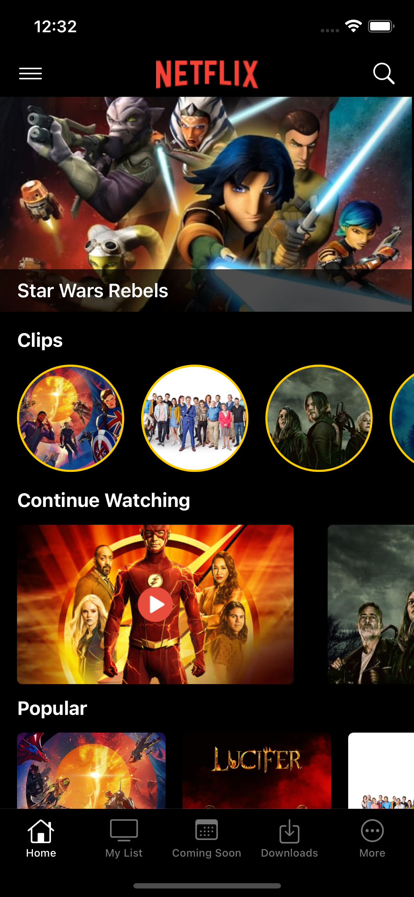
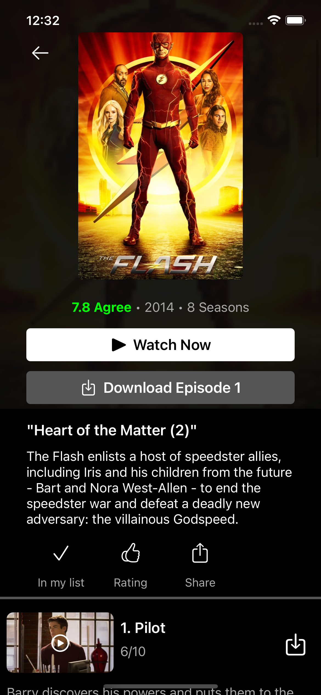
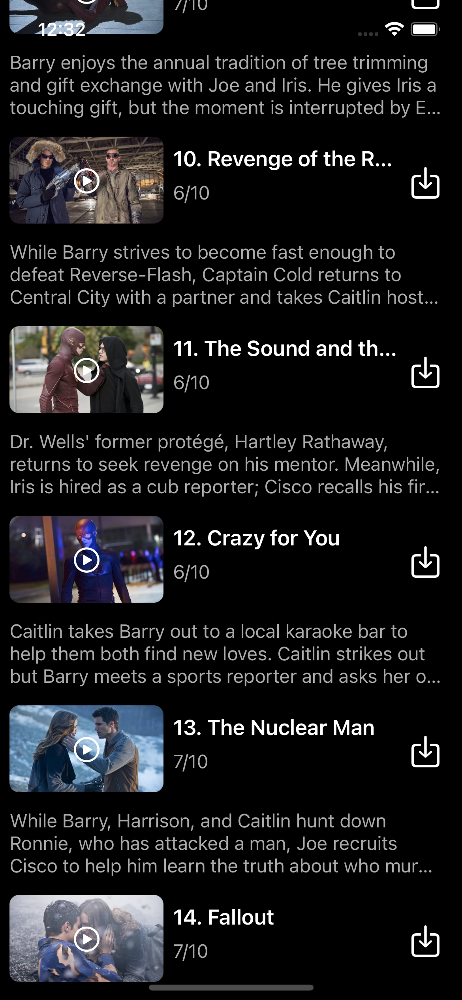
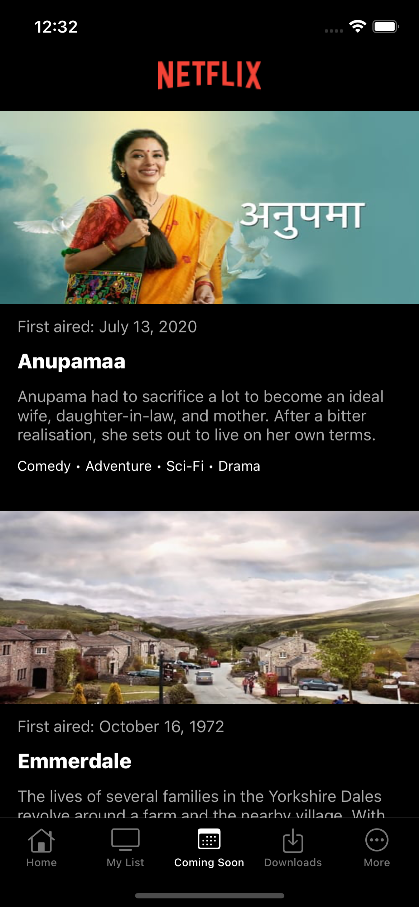

## Netflix Compositional

A clone of the Netflix iOS application built using the new CollectionView APIs introduced in WWDC 2019 for iOS 13. 

Powered using sample movies from TheMovieDB API. 

#### Technologies & Frameworks used:

* Xcode 11
* Swift 5.2 
* UIKit 
* CompositionalLayouts
* DiffableDataSources
* REST API Fetching (TheMovieDB API)
* Image Caching

#### Sample Screens 

    
    
     
    
    

